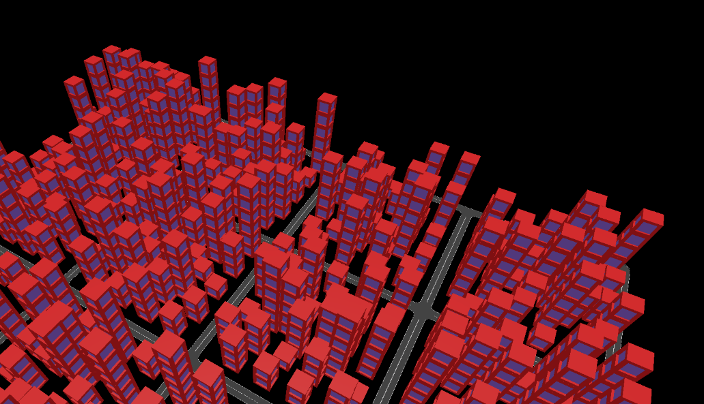

# City Generator

## Network loading
We load the network from a SUMO network file, which lists road edges and their lanes.
Each lane and junction is encoded as a polygons (lists of coordinates).
We merge all lanes and junctions together to obtain one road network polygon.
While merging lanes together, we calculate the seams in order to draw dashed lines between lanes.
Note that the polygon might contain holes, which define the pieces of land where buildings may be placed.
Of course, buildings can also placed on the land outside of the polygon's outer boundary.

## Lot divison
The polygon holes might be subdivided into individual building lots, where individual structures may be build.
A very straightforward approach would be to sample some uniform points in the hole and then compute the Vonoroi divison, such that each cell becomes a building lot.

## Modular building placement
To obtain some diversity in buildings, one could stack together modular building blocks.
Using a global grid, we compute for each building lot which grid cells are completely contained by the lot polygon.
On these valid cells, we place a random stack of prebuild building block.
These building blocks have been modelled in Blender.

## Miscellaneous

- [x] fix network loading
- [x] export polygon and holes
- [ ] road textures
- [ ] dashed lines between lanes (maybe using three.Curve.getSpacedPoints())
- [ ] skybox
- [ ] anti-aliasing
